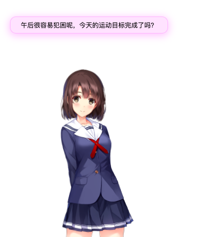

# live2D-message

> 关于人物模型的message功能，目前完全使用了另外一个github开源项目的代码。

#### 原工程地址👉[galnetwen/Live2D](https://github.com/galnetwen/Live2D "galnetwen")

#### 依赖文件
- jquery.min.js
- message.js
- message.json

核心文件的修改以及如何使用都可以参考上面的源工程。

使用方法很简单，例如——

[圣女惠](https://github.com/fguby/live2D/blob/master/katou.html "圣女惠")

效果如图

